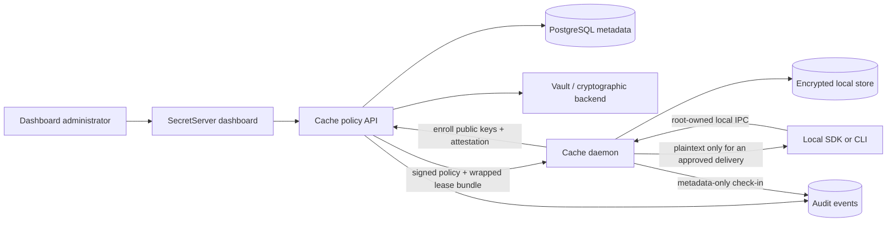

# Architecture

## Components

## Dashboard authority

Add **Settings → Offline Cache** with a tenant-level master switch. The switch and policies must be persisted; the current generic settings handler is not sufficient because it only echoes values.

A policy version contains:

- Enabled state.
- Fixed TTL and server-enforced maximum TTL.
- Exact resource IDs and version behavior (`pinned` or `latest_at_issue`).
- Approved devices or device class.
- Required assurance tier.
- Approved local consumers and delivery modes.
- Maximum entries and encrypted bytes.
- Renewal window and online check-in requirement.

Editing creates a new version. Active leases remain unchanged and may only expire earlier if the daemon reconnects and receives a signed revocation. No dashboard edit can lengthen an already issued lease.

## Device enrollment

1. The daemon generates an enrollment signing key and a key-wrapping key. Hardware-bound devices generate both inside the TPM where supported.
2. The daemon sends public keys, platform information, a one-time device authorization code, and attestation evidence.
3. An administrator approves the device and assigns an immutable policy version.
4. SecretServer returns the tenant policy-signing public key, device certificate, and signed enrollment result.
5. The root-owned daemon installation stores only public configuration and hardware-sealed private handles.

Do not use mutable hardware fingerprints as identity. Identity is the approved public key plus attestation and server record.

## Lease issuance

1. Verify tenant and policy are enabled, device is approved, and requested policy version is current.
2. Resolve the exact secret versions server-side.
3. Generate a random content-encryption key for this lease.
4. Encrypt each record and bind it to lease ID, policy hash, resource ID, version, and expiry using AEAD associated data.
5. Wrap the lease key to the device using a standardized HPKE suite.
6. Sign the canonical manifest using a tenant cache-policy signing key held by an HSM/KMS where available.
7. Return one atomic bundle. Never return a reusable API token or plaintext cache key.

## Local store

Use a single-writer transactional embedded database. Store:

- Signed policy and lease manifests.
- Wrapped lease key.
- HMAC-derived lookup identifiers.
- Encrypted records and non-secret provenance.
- Trusted-time high-water mark and lease sequence.

Never store decrypted values. Decrypt into locked memory only for a permitted delivery and wipe immediately afterward. Disable core dumps and prevent inclusion in backup, indexing, telemetry, and support-bundle tooling.

## Local IPC and consumers

- Linux/macOS: root-owned Unix domain socket, no TCP listener.
- Windows: ACL-restricted named pipe.
- Authenticate callers using OS peer credentials.
- Optionally require an approved executable hash or platform code-signing identity.
- Reject symlinked sockets, path overrides, inherited permissive umasks, and unknown peers.

Preferred delivery is an inherited pipe or file descriptor to an approved child process. SDK-compatible reads may return plaintext over authenticated local IPC only when the signed dashboard policy explicitly enables `plaintext_read`.

## Time and rollback

- Verify signed `not_before` and `expires_at`.
- Compare wall time with a server-established high-water mark and the process monotonic clock.
- A backward clock jump quarantines the lease.
- A forward clock jump may expire early and must never restore validity when reversed.
- Standard assurance requires online revalidation after daemon restart.
- Hardware assurance persists lease sequence and time evidence with TPM-backed anti-rollback state.

## Server data model

- `cache_settings`: tenant master switch and maximum TTL.
- `cache_policies`: immutable versioned policy manifests.
- `cache_policy_resources`: exact policy resource bindings.
- `cache_devices`: public keys, attestation, status, assurance tier, revocation.
- `cache_leases`: device, policy version, monotonic sequence, issue/expiry, wrapped-key digest, status.
- `cache_events`: enrollment, approval, issue, refresh, hit/miss metadata, expiry, rollback detection, revocation.

Server tables contain no local plaintext values or unwrapped lease keys.
